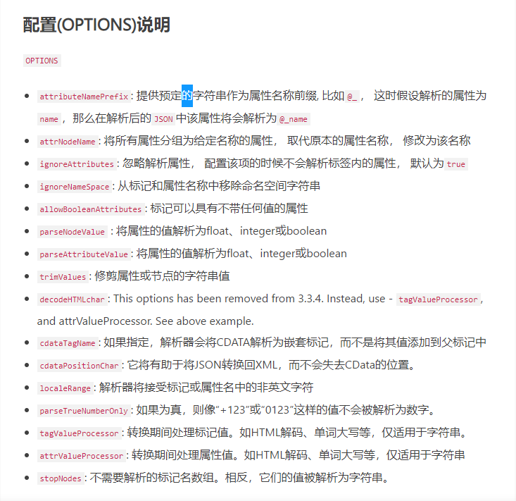

# 功能要点
## nav部分
### 新建文件
#### 实现方法
```js
window.meta2d.open()
```
执行挂载到window身上的meta2d对象的open方法
方法内部细节：
```ts
// mate2d.open
  open(data?: Meta2dData, render: boolean = true) {
    this.clear(false); // 执行清理函数 核心部分
    if (data) { //判断是否为加载文件 
        this.setBackgroundImage(data.bkImage); // 设置背景图片
        Object.assign(this.store.data, data); // 将传入的数据 复制到meta2d的store中 此stroe由createstore创建
        this.store.data.pens = []; // 将store中的图元初始化清空
        // 第一遍赋初值  将传入的数据进行数据清洗 使得传入到store中的值符合标准
        for (const pen of data.pens) {
            if (!pen.id) { // 图元无id则赋值id
                pen.id = s8(); // 8位随机id
            }
            !pen.calculative && (pen.calculative = { canvas: this.canvas }); // 图元无calculatrive计算属性则赋值
            this.store.pens[pen.id] = pen; // 存入到store中
        }
        for (const pen of data.pens) {
            this.canvas.makePen(pen);
        }
    }
    if (!render) {
        this.canvas.opening = true;
    }
    this.initBindDatas(); // 绑定传入数据到store中
    this.render();
    this.listenSocket();
    this.connectSocket();
    this.startAnimate();
    this.startVideo();
    this.doInitJS();
    this.store.emitter.emit('opened'); // 触发store事件

    if (this.canvas.scroll && this.canvas.scroll.isShow) {
        this.canvas.scroll.init();
    }
}
```

### 打开保存的文件
#### 实现方法
```js
// example/vue/meta2d.vue
onOpen = (e) => {
  const file = e.target.files[0];  // 获取文件对象
  if (!file) {
    return;
  }
  const reader = new FileReader(); // FileReader读取文件对象
  reader.onload = (event) => { // 监听读取成功事件
    try {
      const json = JSON.parse(event.target.result); // 解析json数据
      window.meta2d.open(json); // meta2d执行打开方法，传入数据
    } catch(e) {
      console.log("读取文件失败，请检查数据格式");
    }
  };
  reader.readAsText(file);// 执行读取方法
};
```
### 保存文件
通过创建a链接 添加download属性执行下载
#### 实现方法
```js
// example/vue/meta2d.vue
const onSave = () => {
  const filename = "测试数据.json";  //文件名
  const data = window.meta2d.data(); //核心 将画布中的数据转换文json格式
  const json = JSON.stringify(data, undefined, 4); // 解析json
  const blob = new Blob([json], { type: "text/json" }); // 生成blob数据
  const a = document.createElement("a"); // 通过a链接的dowmload下载 
  a.download = filename; // 下载文件名
  a.href = window.URL.createObjectURL(blob); // j将a的下载地址指向文件内存地址
  a.dataset.downloadurl = ["text/json", a.download, a.href].join(":"); //TODO 暂不明确其作用
  a.click(); // 点击执行下载
};
```
#### 核心部分实现细节
```ts
  data(): Meta2dData {
    const data: Meta2dData = deepClone(this.store.data); // 深拷贝 数据仓库中的数据
    const { pens, paths } = this.store.data; // 结构pens和paths信息
    data.version = pkg.version; // 获取版本信息
    // TODO: 未在 delete 时清除，避免撤销等操作。
    // 清除一些未使用到的 paths   paths配置项有何作用？？
    data.paths = {};
    for (const pathId in paths) {
        if (Object.prototype.hasOwnProperty.call(paths, pathId)) {
            if (pens.find((pen) => pen.pathId === pathId)) {
                data.paths[pathId] = paths[pathId];
            }
        }
    }
    return data; // 返回json数据
}

```
### 钢笔
通过meta2d对象的finishPencil方法实现，具体实现如下
#### 实现方法
```js
  onTogglePen = () => {
    // 注意此方法存在bug
    isPencilActive.value = false;
    window.meta2d.finishPencil(); //  执行绘图方法
    isPenActive.value = true; 
    window.meta2d.drawLine("curve");  // 绘画函数
};


// finishPencil
async finishPencil() {
    if (this.pencilLine) {
        const anchors: Point[] = simplify(
            this.pencilLine.calculative.worldAnchors,
            10,
            0,
            this.pencilLine.calculative.worldAnchors.length - 1
        );
        let p = getFromAnchor(this.pencilLine);
        anchors.unshift({ id: p.id, penId: p.penId, x: p.x, y: p.y });
        p = getToAnchor(this.pencilLine);
        anchors.push({ id: p.id, penId: p.penId, x: p.x, y: p.y });
        this.pencilLine.calculative.worldAnchors = smoothLine(anchors);
        if (this.pencilLine.calculative.worldAnchors.length > 1) {
            this.pencilLine.calculative.pencil = false;
            this.store.path2dMap.set(
                this.pencilLine,
                globalStore.path2dDraws[this.pencilLine.name](this.pencilLine)
            );
            const allowAdd =
                (!this.beforeAddPens ||
                    (await this.beforeAddPens([this.pencilLine]))) &&
                (!this.beforeAddPen || this.beforeAddPen(this.pencilLine));
            if (allowAdd) {
                this.initLineRect(this.pencilLine);
                this.store.data.pens.push(this.pencilLine);
                this.store.pens[this.pencilLine.id] = this.pencilLine;
                this.store.emitter.emit('add', [this.pencilLine]);
                this.active([this.pencilLine]);
                this.pushHistory({
                    type: EditType.Add,
                    pens: deepClone([this.pencilLine], true),
                });
            }
        }
        this.pencilLine = undefined;
        this.render();
    }
}

// drawLine
drawLine(lineName?: string) {
    lineName && lockedError(this.store);
    this.canvas.drawingLineName = lineName; //在钢笔状态
}
```

### 铅笔
#### 实现方法
...
### 放大镜
#### 实现方法
在meta2d实例身上有canvas实例，在canvas实例中挂载了MagnifierCanvas实例，通过appendChild添加到父元素中，父元素监听鼠标移动事件通过调用渲染函数，在放大镜的渲染函数中进行鼠标位置的确定最终操作放大镜跟随鼠标移动
```ts
    const pt = {
      x:
        (this.parentCanvas.mousePos.x + this.store.data.x) *
        this.store.dpiRatio,
      y:
        (this.parentCanvas.mousePos.y + this.store.data.y) *
        this.store.dpiRatio,
    };
    const drawOffscreens = [
      this.parentCanvas.canvasImageBottom.offscreen,
      this.parentCanvas.canvasImageBottom.animateOffsScreen,
      this.parentCanvas.offscreen,
      this.parentCanvas.canvasImage.offscreen,
      this.parentCanvas.canvasImage.animateOffsScreen,
    ];
    // 跟随鼠标绘制  双缓冲
    drawOffscreens.forEach((offscreen) => {
      ctx.drawImage(
        offscreen,
        pt.x - r,
        pt.y - r,
        this.magnifierSize,
        this.magnifierSize,
        0,
        0,
        this.magnifierSize,
        this.magnifierSize
      );
```
放大效果实现
```ts
const ctx = this.magnifierScreen.getContext(
      '2d'
    ) as CanvasRenderingContext2D;
    ctx.clearRect(0, 0, size, size);
    ctx.lineWidth = 5;

    ctx.save();
    ctx.translate(2.5, 2.5);

    ctx.save();
    ctx.arc(r, r, r, 0, Math.PI * 2, false);
    ctx.clip();
    ctx.fillStyle =
      this.store.data.background || this.store.options.background || '#f4f4f4';
    ctx.fillRect(0, 0, size, size);
    ctx.translate(-r, -r);
    ctx.scale(2, 2); // 放大效果实现
```
### 缩略图
#### 实现方法
在源代码中，该功能封装为ViewMap类，本质上是通过将父元素的canvas转为png，然后将其渲染到界面中
```ts
class ViewMap {
    box: HTMLElement;
    readonly boxWidth = 320;  // 定宽
    readonly boxHeight = 180; // 定高
    readonly ratio = this.boxWidth / this.boxHeight; // 定宽高比
    readonly padding = 5; // 内边距
    img: HTMLImageElement;
    isShow: boolean;  // 展示
    isDown: boolean;  //
    view: HTMLElement; // 可视区域外框
    constructor(public parent: Canvas) { // 父canvas图元
        this.box = document.createElement('div'); // 创建缩略图区域
        this.img = new Image(); // 该图片作用？
        this.view = document.createElement('div'); // 创建可视区域

        this.box.appendChild(this.img);
        this.box.appendChild(this.view);
        this.parent.externalElements.appendChild(this.box);// 将其添加到父元素的额外元素中

        this.box.className = 'meta2d-map'; // 设置类名 绑定样式
        // 绑定事件
        this.box.onmousedown = this.onMouseDown;
        this.box.onmousemove = this.onMouseMove;
        this.box.onmouseup = this.onMouseUp;
        // 绑定样式 在线
        let sheet: any;
        for (let i = 0; i < document.styleSheets.length; i++) {
            if (document.styleSheets[i].title === 'le5le/map') {
                sheet = document.styleSheets[i];
            }
        }
        // 绑定样式 离线
        if (!sheet) {
            let style = document.createElement('style');
            style.type = 'text/css';
            style.title = 'le5le.com/map';
            document.head.appendChild(style);

            style = document.createElement('style');
            style.type = 'text/css';
            document.head.appendChild(style);
            sheet = style.sheet;
            sheet.insertRule(
                `.meta2d-map{display:flex;width:${
                    this.boxWidth + 2 * this.padding
                }px;height:${this.boxHeight + 2 * this.padding}px;padding:${
                    this.padding
                }px;background:#f4f4f4;border:1px solid #ffffff;box-shadow: 0px 0px 14px 0px rgba(0,10,38,0.30);border-radius:8px;position:absolute;z-index:9999;right:0;bottom:0;justify-content:center;align-items:center;cursor:default;user-select:none;overflow: hidden;}`
            );
            sheet.insertRule(
                '.meta2d-map img{max-width:100%;max-height:100%;pointer-events: none;}'
            );
            sheet.insertRule(
                '.meta2d-map div{pointer-events: none;border:1px solid #1890ff;position:absolute}'
            );
        }
    }
    // 显示 本质通过将界面输出为图片的形式
    show() {
        this.box.style.display = 'flex';
        // 数据来源
        const data = this.parent.store.data;
        if (data.pens.length) { // 若有图元
            this.img.style.display = 'block';
            this.img.src = this.parent.toPng(); // 将父元素canvas渲染为png图片
            this.setView(); // 显示在界面上
        } else {
            this.img.style.display = 'none';  // 若无图元则不操作
        }
        this.isShow = true; // 设置show转态为true
    }

    hide() { // 隐藏缩略图
        this.box.style.display = 'none';
        this.isShow = false;
    }
    // ...
}
```
#### 子功能
##### 自动缩放 
 该功能主要是通过 setView方法来动态计算得出
```ts
setView() {
    const data = this.parent.store.data; // 拿到父元素数据
    if (data.pens.length) { // 查看是否有图元
        const rect = getRect(data.pens); // 获取图元位置信息 涉及到最大值和最小值
        // rect += data.x y 得到相对坐标
        translateRect(rect, data.x, data.y);
        const rectRatio = rect.width / rect.height; // 宽高比
        if (rectRatio > this.ratio) {
            // 上下留白，扩大高度
            const height = rect.width / this.ratio;
            rect.y -= (height - rect.height) / 2;
            rect.height = height;
            calcRightBottom(rect);
        } else {
            // 左右留白，扩大宽度
            const width = rect.height * this.ratio;
            rect.x -= (width - rect.width) / 2;
            rect.width = width;
            calcRightBottom(rect);
        }
        const canvasRect = this.parent.canvasRect;
        let left = 0,
            top = 0;
        if (rect.x < 0) {
            left = -rect.x / rect.width;
        } else if (rect.x + rect.width > canvasRect.width) {
            let space = 0;
            if (canvasRect.width > rect.width) {
                // 均已左上角为起点，这种场景需要剪掉一个留白
                space = canvasRect.width - rect.width;
            }
            left = (-rect.x + space) / rect.width;
        }

        if (rect.y < 0) {
            top = -rect.y / rect.height;
        } else if (rect.y + rect.height > canvasRect.height) {
            let space = 0;
            if (canvasRect.height > rect.height) {
                space = canvasRect.height - rect.height;
            }
            top = (-rect.y + space) / rect.height;
        }

        const width =
            canvasRect.width > rect.width ? 1 : canvasRect.width / rect.width;
        const height =
            canvasRect.height > rect.height ? 1 : canvasRect.height / rect.height;
        this.view.style.left = this.padding + left * this.boxWidth + 'px';
        this.view.style.width = width * this.boxWidth + 'px';
        this.view.style.top = this.padding + top * this.boxHeight + 'px';
        this.view.style.height = height * this.boxHeight + 'px';
    }
}

```
##### 点击自动对齐视图（点哪儿哪儿位于中间）
##### 视野同步移动
通过监听mouseUp和，mouseMove事件来调用父元素的gotoView函数
```ts
   onMouseMove = (e: MouseEvent) => {
    e.preventDefault();
    e.stopPropagation();

    if (this.isDown) {
      try {
        this.parent.gotoView(
          e.offsetX / this.box.clientWidth,
          e.offsetY / this.box.clientHeight
        );
      } catch (e) {
        console.warn(e.message);
        this.isDown = false;
      }
    }
  };

   onMouseUp = (e: MouseEvent) => {
    e.preventDefault();
    e.stopPropagation();
    try {
      this.parent.gotoView(
        e.offsetX / this.box.clientWidth,
        e.offsetY / this.box.clientHeight
      );
    } catch (e) {
      console.warn(e.message);
    } finally {
      this.isDown = false;
    }
  };
```
gotoView函数内部细节
```ts

gotoView(x: number, y: number) { // x,  y 为偏移值
    const rect = getRect(this.store.data.pens);
    if (!isFinite(rect.width)) {
        throw new Error('can not move view, because width is not finite');
    }
    this.store.data.x = this.canvas.clientWidth / 2 - x * rect.width - rect.x;
    this.store.data.y = this.canvas.clientHeight / 2 - y * rect.height - rect.y;
    this.onMovePens();     
    this.canvasImage.init();
    this.canvasImageBottom.init();
    this.render(); //渲染界面
}
```
### 帮助
#### 实现方法
a链接 点击跳转制定帮助页面

## 左侧图标部分
常见的flex布局

## 画布部分
### 图元的放置
通过监听图元的拖拽事件，将图源信息通过拖拽事件的dataTransfer转发给Meta2d对象
```ts
  ondrop = async (event: DragEvent) => { // 监听拖拽事件
    console.log(event,66666)
    if (this.store.data.locked) {
      console.warn('canvas is locked, can not drop');
      return;
    }
    try {
      // TODO: 若画布锁定，阻止默认行为不再执行。在 firefox 上拖拽图片会打开新页
      event.preventDefault();
      event.stopPropagation();
      const json =
        event.dataTransfer.getData('Meta2d') ||
        event.dataTransfer.getData('Text');
      let obj = null;
      console.log(json);

      if (!json) {
        const { files } = event.dataTransfer;
        if (files.length && files[0].type.match('image.*')) {
          // 必须是图片类型
          const isGif = files[0].type === 'image/gif';
          obj = await this.fileToPen(files[0], isGif);
        }
      }
      !obj && (obj = JSON.parse(json));
      obj = Array.isArray(obj) ? obj : [obj];
      const pt = { x: event.offsetX, y: event.offsetY };
      this.calibrateMouse(pt);
      this.dropPens(obj, pt);
    } catch (e) {}
  };
```
### 图元的拖拽，位置移动
```ts
  movePens(e: {
    x: number;
    y: number;
    ctrlKey?: boolean;
    shiftKey?: boolean;
    altKey?: boolean;
}) {
    if (!this.activeRect || this.store.data.locked) {
        return;
    }

    if (!this.initActiveRect) {
        this.initActiveRect = deepClone(this.activeRect);
        return;
    }

    if (
        !this.store.options.moveConnectedLine &&
        this.store.active.length === 1 &&
        (this.store.active[0].anchors[0]?.connectTo ||
            this.store.active[0].anchors[this.store.active[0].anchors.length - 1]
                ?.connectTo)
    ) {
        return;
    }

    if (!this.movingPens) {
        this.initMovingPens();
        this.store.active.forEach((pen) => {
            setHover(pen, false);
        });
        this.store.hover = undefined;
    }
    if (!this.mouseDown) {
        return;
    }

    let x = e.x - this.mouseDown.x;
    let y = e.y - this.mouseDown.y;
    e.shiftKey && !e.ctrlKey && (y = 0);
    e.ctrlKey && (x = 0);
    const rect = deepClone(this.initActiveRect);
    translateRect(rect, x, y);
    const offset: Point = {
        x: rect.x - this.activeRect.x,
        y: rect.y - this.activeRect.y,
    };
    if (!this.store.options.disableDock) {
        this.clearDock();
        const moveDock = this.customMoveDock || calcMoveDock;
        this.dock = moveDock(this.store, rect, this.movingPens, offset);
        const { xDock, yDock } = this.dock;
        let dockPen: Pen;
        if (xDock) {
            offset.x += xDock.step;
            dockPen = this.store.pens[xDock.penId];
            dockPen.calculative.isDock = true;
        }
        if (yDock) {
            offset.y += yDock.step;
            dockPen = this.store.pens[yDock.penId];
            dockPen.calculative.isDock = true;
        }
    }

    this.translatePens(this.movingPens, offset.x, offset.y, true);
}
```

### 图元的缩放

### 图元的旋转

### 图元聚焦

### 图元的事件

### 图元的生命周期

### 图元的锚点

### 锚点之间的链接

### 图元的框选（多个）


### 该项目的render函数？


### 框选工具如何实现？


### 网格吸附功能如何实现

### fast-xml-parser
#### 相关配置


### 学习svg相关知识